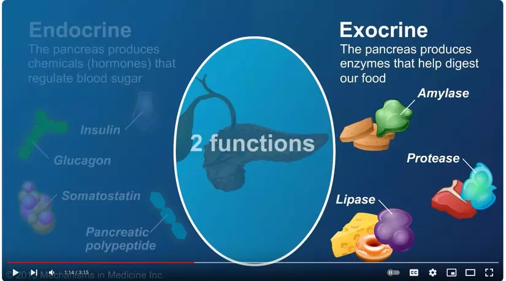
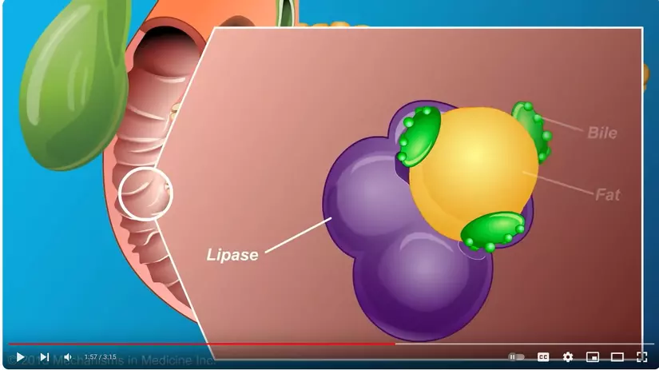
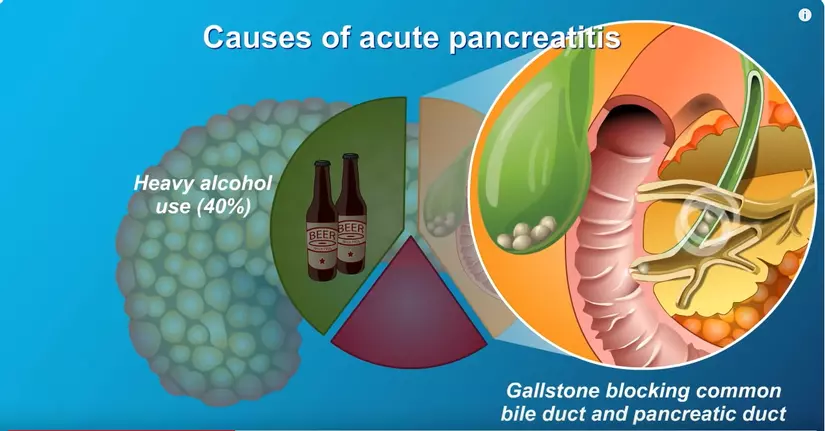
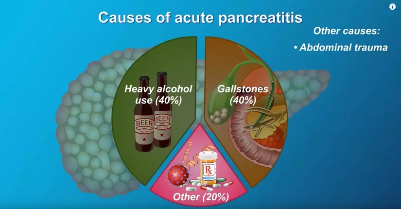

## References
- [The Role and Anatomy of the Pancreas](https://www.youtube.com/watch?v=NZ4zcrTzUjA)
- [Acute Pancreatitis](https://www.youtube.com/watch?v=inRSjh3bHPg)

====
====

## Enzyme và tuyến tụy

**Tuyến tụy** là một cơ quan quan trọng đóng vai trò kép trong hệ thống tiêu hóa và hệ thống nội tiết.

**Về mặt tiêu hóa:**

Tuyến tụy sản xuất ra các enzyme tiêu hóa được tiết vào tá tràng qua ống tụy. Các enzyme này bao gồm:

* **Amylase:** Phân hủy tinh bột thành đường đơn.
* **Protease:** Phân hủy protein thành axit amin.
* **Lipase:** Phân hủy chất béo thành axit béo và glycerol.

**Về mặt nội tiết:**

Tuyến tụy sản xuất ra các hormone quan trọng giúp điều chỉnh lượng đường trong máu:

* **Insulin:** Giúp tế bào hấp thu glucose từ máu, làm giảm lượng đường trong máu.
* **Glucagon:** Giúp gan giải phóng glucose vào máu, làm tăng lượng đường trong máu.

**Mối quan hệ giữa enzyme và tuyến tụy:**

* Các enzyme tiêu hóa được sản xuất bởi các tế bào acinar của tuyến tụy.
* Các enzyme này được tiết ra dạng tiềm năng (không hoạt động) để tránh tự tiêu hóa tuyến tụy.
* Khi đến tá tràng, các enzyme được kích hoạt bởi các enzyme khác và bắt đầu quá trình tiêu hóa.
* Bất kỳ sự bất thường nào trong sản xuất hoặc hoạt động của enzyme tụy đều có thể dẫn đến các vấn đề tiêu hóa.

====
====

## Mối liên hệ giữa tuyến tụy và mật

**Tuyến tụy và mật** là hai cơ quan quan trọng trong hệ tiêu hóa. Chúng hoạt động cùng nhau để giúp tiêu hóa thức ăn, đặc biệt là chất béo.

**Mối liên hệ giữa tuyến tụy và mật bao gồm:**

**1. Vị trí:**

* Tuyến tụy nằm ở phía sau dạ dày, gần túi mật.
* Ống tụy chính hợp nhất với ống mật chung để tạo thành ống mật chủ, đổ vào tá tràng.

**2. Chức năng:**

* **Tuyến tụy:**
    * Sản xuất enzyme tiêu hóa: amylase, protease, lipase.
    * Enzyme lipase giúp tiêu hóa chất béo.
* **Mật:**
    * Được sản xuất bởi gan và lưu trữ trong túi mật.
    * Giúp nhũ hóa chất béo để enzyme lipase có thể hoạt động hiệu quả.

**3. Hợp tác:**

* Khi thức ăn đi từ dạ dày vào tá tràng, các enzyme tiêu hóa của tuyến tụy và mật được tiết ra cùng lúc.
* Mật nhũ hóa chất béo thành các phân tử nhỏ hơn.
* Enzyme lipase phân hủy các phân tử chất béo nhỏ này thành axit béo và glycerol.

====
====

## Tại sao tắc ống mật dẫn đến viêm tụy cấp (Acute Pancreatitis)?

**Ống mật** là một ống nhỏ dẫn dịch mật từ túi mật và gan vào ruột non. Dịch mật giúp tiêu hóa chất béo. Khi **ống mật bị tắc nghẽn**, dịch mật không thể chảy vào ruột non, dẫn đến các vấn đề sau:

**1. Ứ mật:** Dịch mật ứ đọng trong gan và túi mật, gây ra các triệu chứng như đau bụng, buồn nôn, nôn mửa, vàng da, vàng mắt.

**2. Viêm tụy cấp:** Khi dịch mật ứ đọng, nó có thể trào ngược vào ống tụy, kích hoạt các enzyme tiêu hóa trong tụy. Các enzyme này sẽ bắt đầu tiêu hóa chính mô tụy, dẫn đến **viêm tụy cấp**.

**Viêm tụy cấp** là một bệnh lý nguy hiểm, có thể dẫn đến các biến chứng như hoại tử tụy, nhiễm trùng, suy hô hấp, và tử vong.

